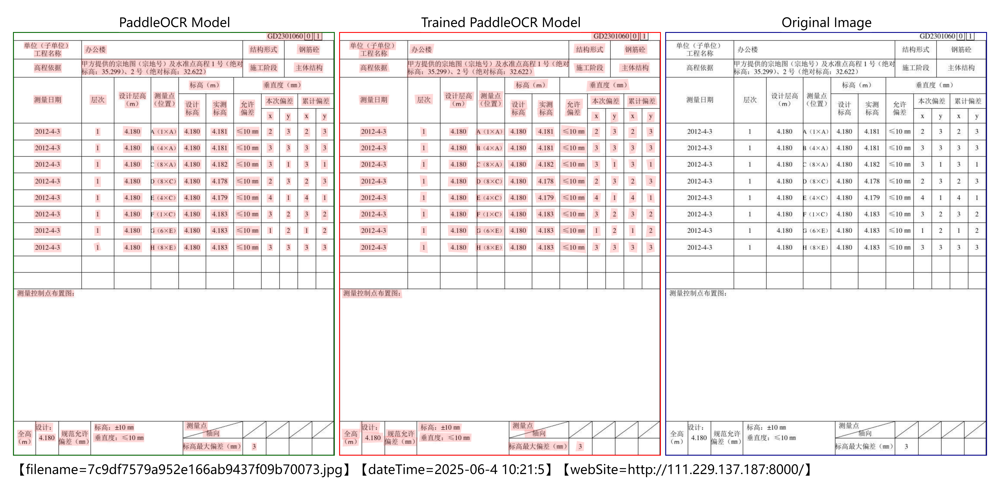
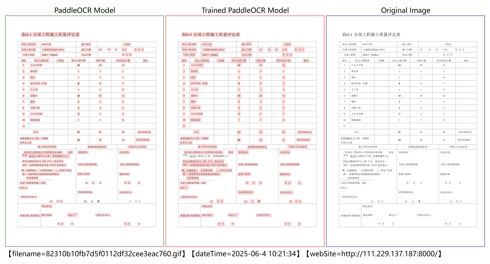
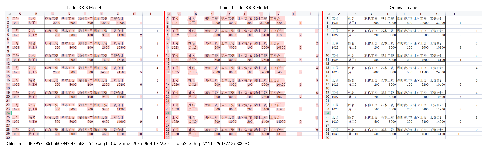
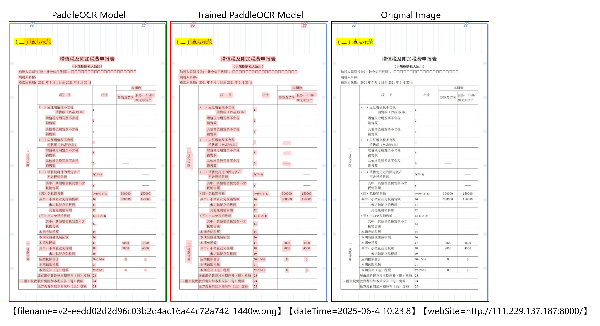
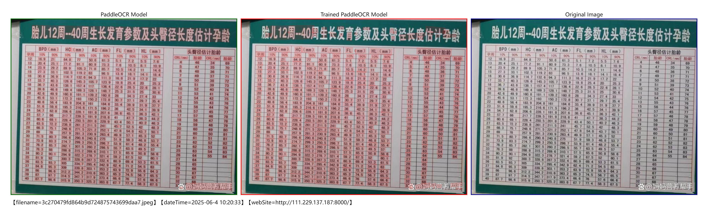

## Data-Driven PaddleOCR Table Detection Enhancement

**Keywords**

OCR, Bengali, Chinese Detection, Chinese Tables, Table Models, Table Recognition, Data Annotation, Data Synthesis,
Data Generation, Data Augmentation, Chinese-English Dataset, OCR Recognition, PaddleOCR, Paddle, Donut, 
EasyOCR,table structure recognition, layout analysis, RapidOCR, Tesseract, Synthetic Data, Table Detection, 
SynthID-Text, SynthTiger, Text Renderer.

**Project Overview**
This project investigates AI-powered software to enhance OCR model performance in table
detection scenarios, offering a structured solution for OCR within table layouts.

**[An online demo](http://111.229.137.187:8000/)** allows you to upload images and compare the detection results of different models.

**Background**

OCR technology plays a critical role in digital transformation, particularly in document processing and invoice
recognition. This project explores techniques to improve OCR model performance and validates the effectiveness of
a trained model in real-world applications. This project offers a viable pathway and technical reference for
building more robust OCR structured systems through data-driven model optimization.

**Features**

*   **[Online Demo](http://111.229.137.187:8000/):** A web interface for image uploads and model comparison.
*   **Model Comparison:** An online platform allows for direct comparison of the trained model's detection results with those of the PaddleOCR model.
*   **Dataset Exploration:** A technique-driven approach to data preparation that reduces reliance on manual
annotation, lowering data preparation costs.

**Demo Implementation**

Flask, LeaferJS were used for building the web
interface and deployment.

**Project Progress**

*   **Model Training:** A model was trained on a custom dataset to address challenges in detecting small text
within tabular data and resolving issues where closely spaced columns are merged.
*   **Demo Deployment:** The online demo is deployed to showcase significant performance improvements in table
detection accuracy and robustness.
*   **Multilingual Support Exploration:** Preliminary exploration of applying related techniques in multilingual
scenarios, with a trained Bengali detection model.

**Future Plans**

*   Continue exploring model performance.
*   Open to exploring new applications of OCR technology and collaborating on innovative
projects.

**Collaboration & Opportunities**

Discussions regarding OCR technology, data synthesis, and model training are welcome. If you have technical
requirements or are interested in collaboration, please contact me.

**Email:** ms147963@outlook.com

**Notes:**

*   Please contact me via email, to facilitate better record-keeping and organization.
*   Please indicate your preferred language in your email if it differs from English.
*   I will respond to your email as soon as possible. Please allow for processing time.

**Example Images:**

**Performance may be limited in non-documented scenarios.**

